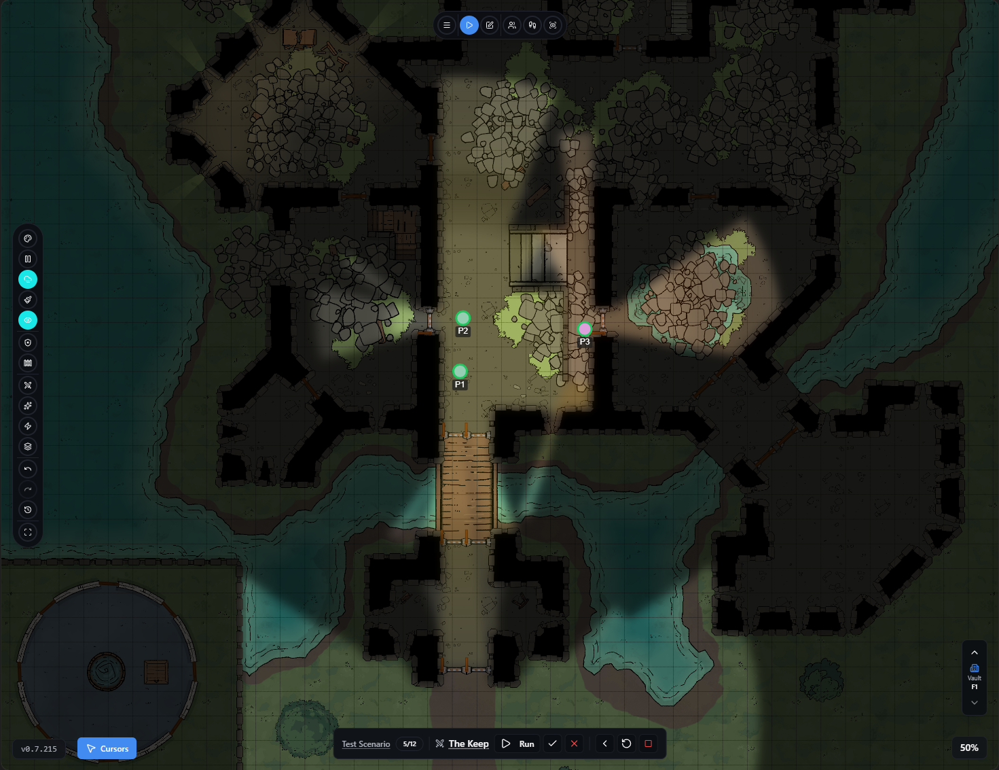
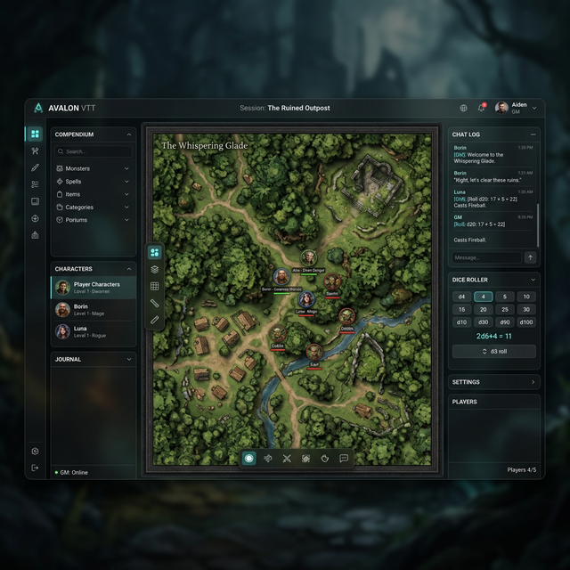

# Mage Hand: UI Redesign Plan

## 1. Design Vision
Maintain and elevate the current sleek, modern aesthetic visible in the Play Mode. The existing pill-shaped toolbars and circular buttons are an excellent foundation. The goal is to extend this premium, "creative-tool" aesthetic to the denser, more complex interfaces (Menus, Map Managers, Libraries) which currently overwhelm the screen as floating cards.

Original UI

Proposed New UI

## 2. Aesthetic System
*   **Theme:** Continue using the dark-mode theme to make the tabletop map pop. 
*   **Material & Transparency:** Retain the solid, high-contrast dark backgrounds for floating pill toolbars, but introduce subtle glassmorphism (background blur) for larger panels (Sidebars/Docked Cards) to maintain spatial context of the map underneath.
*   **Typography:** Adopt a modern sans-serif (e.g., Inter, Roboto, or Poppins) for high legibility at small sizes, paired with a stylized serif for fantasy-themed headers or chat lore.
*   **Color Palette:**
    *   *Primary/Brand:* A vibrant accent color (e.g., Azure or Arcane Teal, as currently used for active tools) for selections.
    *   *System/Feedback:* Standardized red (destructive/combat), green (success), amber (warnings).
    *   *Surfaces:* Neutral dark grays (e.g., #1A1A1A to #2D2D2D) with subtle lighter borders (#333333) to define depth without heavy drop shadows.

## 3. Component Overhaul
### The Docking Panel System (Floating vs. Docked)
*   **Current State:** 30+ features are isolated into `<Card>` components that float over the canvas, relying on manual window management.
*   **New Design:** Implement a **Docking UI System**. 
    *   Complex cards (like the Creature Library or Map Manager) open inside structured **Left/Right Sidebars** by default.
    *   *Crucially*, any docked panel can be "torn off" (undocked) into a floating card, and any floating card can be dragged back to the edge of the screen to snap and dock into a sidebar. This gives power users multi-monitor or spatial freedom, while keeping the default experience tidy.

### The Toolbars (Keep & Refine)
*   **Current State:** The image shows elegant, pill-shaped toolbars floating along the left and bottom edges using circular buttons. This is *excellent*.
*   **Refinements:**
    *   Ensure all tooltips avoid overlapping the toolbars (as currently implemented).
    *   Use these floating pills exclusively for *rapid, immediate canvas actions* (Drawing, Fog, Pointer, Measurement).
    *   Move *management* actions (Settings, Save/Load, Entity Browsing) off these toolbars and into the App Header or Docked Sidebars.

### The Main Application Header
*   **Current State:** A dense Menu Card handles meta-actions.
*   **New Design:** A standard top-bar or compact header menu. 
    1.  **Application Settings (Gear Icon):** For global config, network, audio.
    2.  **Project Management:** Save, Load, Export.
    3.  **Workspace Toggles:** Quick buttons to show/hide the Left/Right sidebars.
