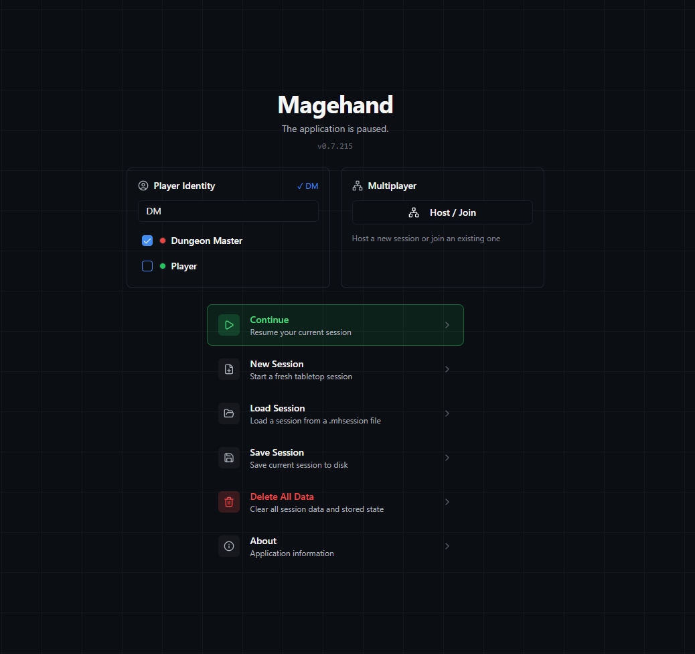
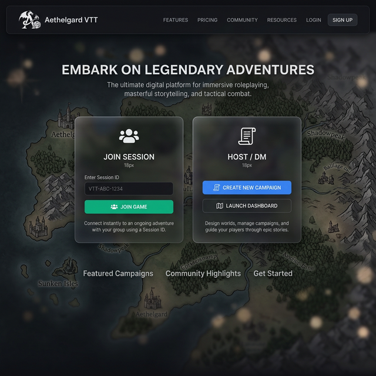

# Mage Hand: UX Redesign Plan

## 1. Executive Summary
The current Mage Hand application has a strong foundation for direct canvas interaction (sleek floating toolbars), but suffers from "feature dumping" in its complex menus. Every new management capability has been added as a floating card, creating a cluttered experience with high cognitive load when dealing with dense information. This plan aims to introduce a flexible, hybrid workspace that organizes complex forms into structured areas while preserving the freedom of the tabletop.

## 2. Core UX Problems
*   **Menu Overload:** The `MenuCard` contains over 25 distinct buttons spanning settings, network sync, world-building, and quick actions.
*   **Card Management:** 30+ floating panels (`CardType`) exist. When several are open (e.g., Map Manager, Library, Character Sheet), they occlude the canvas and require constant manual window management.
*   **Role Confusion:** DMs and Players share many of the same UI surfaces, increasing cognitive load for players who don't need access to world-building tools.

## 3. Proposed Application Flow
### A. The Landing Screen (Session Hub)
A clean, progressive, modal-based entryway:
1.  **Welcome Screen:** Enter Name & Choose Role (DM or Player).
2.  **Action Selection:** 
    *   **For DMs:** "New Campaign", "Load Session", "Host Multiplayer".
    *   **For Players:** "Join Session" (via code or URL).
*This ensures players never see session management tools they don't need, instantly reducing cognitive load.*

Original landing page

Proposed landing page

### B. The Hybrid Workspace (Dock + Float)
Instead of forcing a rigid layout, we introduce a **Flexible Docking System**.

#### The Rules of the Hybrid Workspace
1.  **Rapid Actions Float:** Tools that directly interact with the canvas (Fog brush, pointer, draw shape) remain in the locked, floating pill-toolbars (as currently implemented).
2.  **Complex Data Docks:** Interfaces that require reading lists, forms, or text (Chat, Map Tree, Library) open in the **Sidebars** by default.
3.  **Tear-away Panels:** Any tab or section in a sidebar can be grabbed by its header and dragged into the canvas to become a floating card. Conversely, floating cards can be dragged to the edges of the screen to snap into the sidebar.

#### Left Sidebar: World Building (DM Focus)
*   **Behavior:** Collapsible, dockable pane.
*   **Content:** Map Manager, Map Tree, Creature Library, Textures.
*   *Hidden entirely for Players unless explicitly granted build permissions.*

#### Right Sidebar: Active Gameplay (Shared Focus)
*   **Behavior:** Collapsible, dockable pane.
*   **Content:** Chat Log, Combat/Initiative Tracker, Player Roster.

#### Floating Zones
*   Contextual properties (e.g., clicking a token opens its mini-stat block) should appear near the object as a temporary floating widget that auto-closes when deselected, unless the user explicitly "pins" it.
