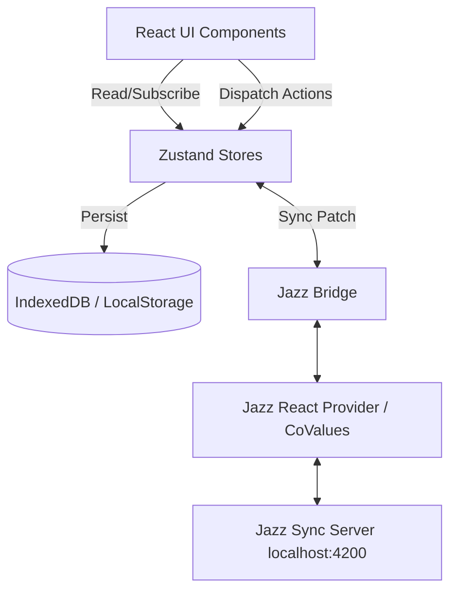

# Mage-Hand Architecture

Mage-Hand is a modern, React-based Virtual Tabletop (VTT) optimized for collaborative D&D 5e sessions. It leverages standard React paradigms paired with global Zustand stores and an optional, powerful peer-to-peer sync engine using [Jazz](https://jazz.tools/).

## Core Principles

1.  **Local-First & Offline-Capable:** The application is built to run entirely in the browser using local storage (IndexedDB & LocalStorage) as the primary data source.
2.  **Optional Multiplayer:** Multiplayer synchronization via Jazz is an additive layer. The app functions completely without it.
3.  **Opt-in Complexity:** Entities range from simple tokens to complex stat blocks with full effect resolution.

## System Architecture

The architecture is broadly divided into three layers:

1.  **UI/View Layer (React):** Components structured around a main canvas tabletop (`SimpleTabletop.tsx`), surrounded by contextual sidebars, floating menus, and modals.
2.  **State Management (Zustand):** Highly decoupled stores handling specific domains (e.g., `sessionStore`, `mapObjectStore`, `effectStore`).
3.  **Synchronization Layer (Jazz/Net):** A bridge that bi-directionally syncs Zustand state with Jazz Collaborative Values (CoValues).

## State Management (Zustand)

Mage-Hand uses multiple granular Zustand stores instead of one monolithic store.

*   **`sessionStore`:** The bedrock store containing Tokens, Players, Viewport state, and basic visibility settings. It tracks the core "who and where" of the VTT.
*   **`mapObjectStore`:** Manages static interactables like doors, columns, and walls.
*   **`regionStore`:** Manages drawn canvas regions (water, traps, fog shapes).
*   **`effectStore`:** Manages spell effects, auras, and templates with complex hit-testing.
*   **Ephemeral Stores (`cursorStore`, `presenceStore`):** Manage transient data not meant for long-term persistence (like live mouse cursors).

Stores use a custom `syncPatch` middleware (from `src/lib/sync/index.ts`) which hooks into store updates to serialize and broadcast changes.

### Schema & System Entity Merging (`applySystemSeeds`)
Because the VTT is heavily schema-driven and persists data via Zustand's `persist` middleware to `localStorage`, system-provided entities (like base blueprints for Actions or Intents) can become stale after application code updates.
To solve this, Mage-Hand utilizes a standard state merge helper: `applySystemSeeds` (in `src/lib/utils/stateMerge.ts`). This is invoked within the store's `merge` function and guarantees that any **system-seeded** keys perfectly overwrite their localStorage counterparts on load, while safely preserving user-created custom entities. Any newly standardized schema properties automatically propagate to the client without forcing a cache wipe.

## Jazz Transport Implementation

Jazz provides Multi-Writer CRDTs (Conflict-free Replicated Data Types) via `CoValues`. Mage-Hand integrates Jazz as a transport layer rather than replacing its entire state architecture.

### 1. Provider Wrapper
`App.tsx` wraps the app in `<JazzSessionProvider>` which initializes connection to a self-hosted sync server (defaulting to `ws://localhost:4200`). This initializes the `MageHandAccount` schema.

### 2. Schema Definition (`src/lib/jazz/schema.ts`)
The schema mirrors the application types using Jazz's `co.map()` and `co.list()`.
*   **Fine-Grained Sync:** Entities that change frequently and independently (Tokens, Regions, MapObjects, Effects) have explicit `co.map` definitions.
*   **Blob Sync:** Less frequent or highly complex holistic state (e.g., Initiative order, Maps list) are synced as serialized JSON blobs via `JazzDOBlob`.
*   **File Streams:** Large binary data (Textures) are excluded from standard CoValues and synced via Jazz `FileStream`.

### 3. The Bridge (`src/lib/jazz/bridge.ts`)
The bridge is the core translation layer between Zustand and Jazz.

*   **Outbound (Zustand -> Jazz):** Store subscriptions watch for state changes. Upon change, the bridge serializes the Zustand object into a Jazz CoValue `init` shape and pushes the update to the `_sessionRoot`.
*   **Inbound (Jazz -> Zustand):** The bridge subscribes to Jazz CoValue mutations. When a remote peer changes a token, the bridge parses the CoValue and calls the corresponding Zustand store (`_fromJazz` flag is set to prevent echo loops).

#### Drag Optimization & Echo Prevention
To prevent "rubber-banding" during fast local updates (like dragging a token), the bridge implements a drag-grace period. Inbound position updates are suppressed while a token is actively being dragged locally (`markTokenDragStart`/`markTokenDragEnd`).

## Key Shared Components

*   **`PathSuggestInput`** (`src/components/rules/PathSuggestInput.tsx`): A reusable text input with an autocomplete dropdown designed for JSON path exploration. Used across tools like the Rule Inspector and Adapter Editor to provide intellisense from dynamic schemas.

## File Structure (src/)
*   **`components/`**: React UI components organized by domain (ui, modals, toolbar, cards).
*   **`lib/`**: Core engine logic, importers, rendering helpers, and the `jazz` transport module.
*   **`types/`**: Comprehensive TypeScript interfaces for all game entities and systems.
*   **`stores/`**: Zustand state definitions.
*   **`pages/`**: Top-level routing views (`Index.tsx`, `NotFound.tsx`).
*   **`hooks/`**: Custom React hooks for shared logic.
